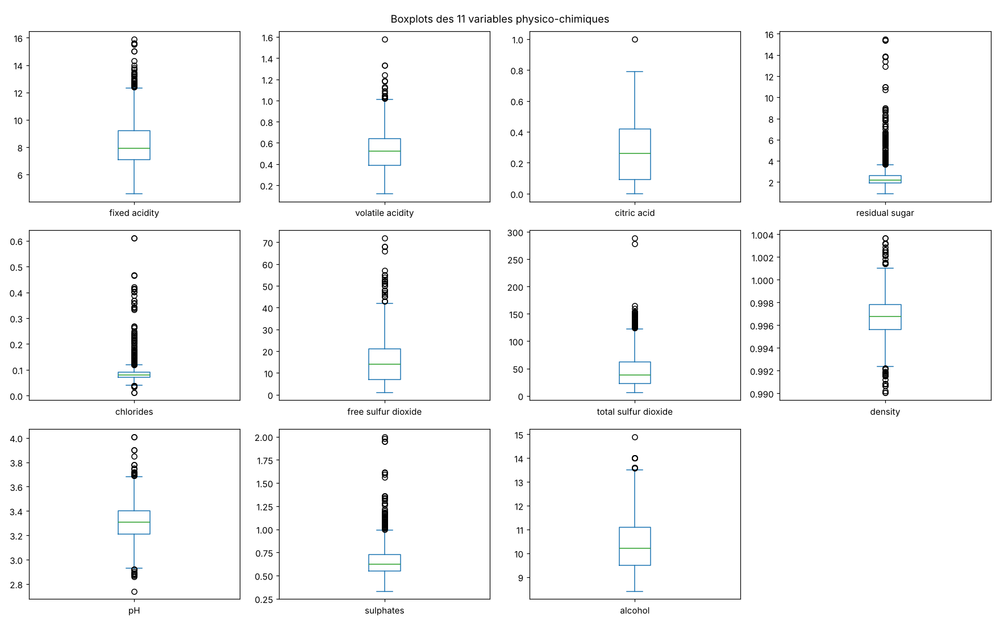
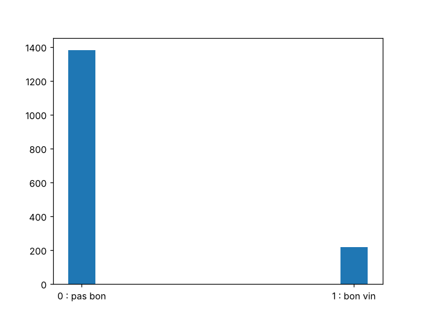
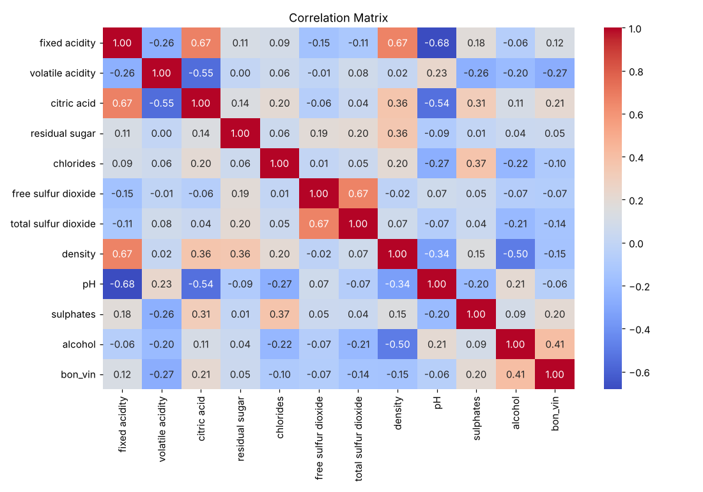
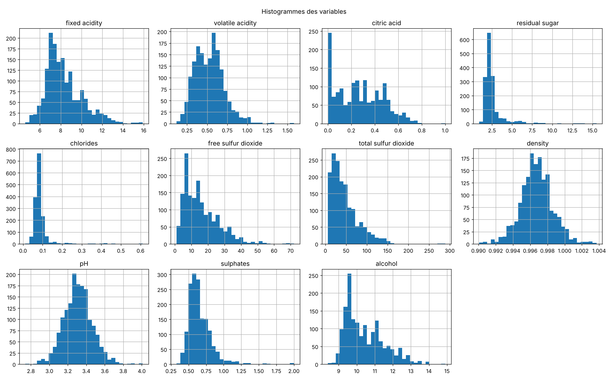
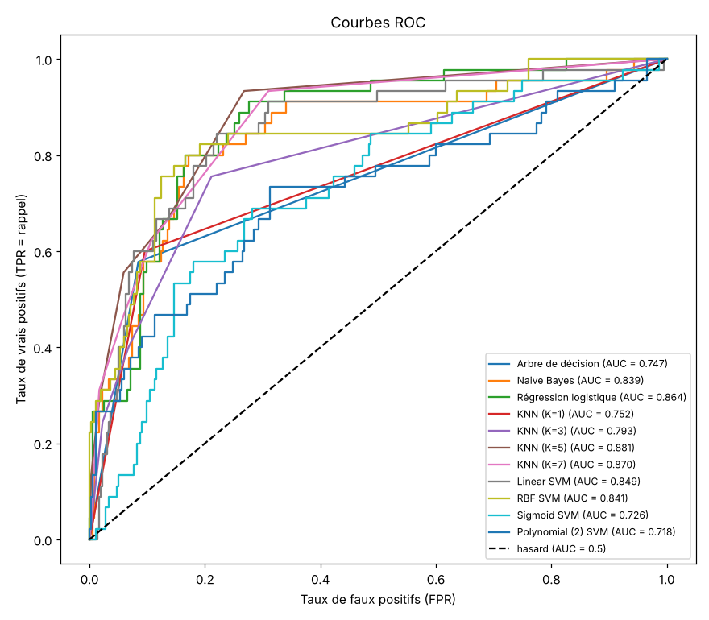

# 1. Introduction

## 1.1 Contexte et objectif

La qualité d'un vin dépend de nombreux paramètres physico-chimiques : acidité, pH, taux d'alcool, sucre résiduel, etc. L'objectif du projet est de construire un **modèle de classification supervisée** qui prédit si un vin est **bon** à partir de ces mesures. Conformément au sujet, le problème est posé sous forme binaire : un vin est « bon » (classe 1) si sa note de qualité est **supérieure ou égale à 7**, sinon il appartient à la classe 0.

## 1.2 Données

Nous utilisons le jeu *Red Wine Quality* (Cortez et al., 2009) :

- **1 599 vins rouges** portugais (*vinho verde*) ;
- **11 variables physico-chimiques** continues : acidité fixe, acidité volatile, acide citrique, sucre résiduel, chlorures, SO2 libre, SO2 total, densité, pH, sulfates, alcool ;
- une note de qualité de 0 à 10, attribuée par des dégustateurs.

## 1.3 Démarche

Le travail suit les quatre étapes du sujet : prétraitement (section 2), modélisation (section 3), évaluation (section 4) et optimisation des hyperparamètres (section 5). Le code, contenu dans le notebook `projet_qualite_vin.ipynb`, reprend celui des TP du cours :

- TP1 et TP3 : chargement, `Counter` pour les classes, `train_test_split` (25 % de test, `random_state=1`), `StandardScaler`, arbre de décision (`entropy`), Naive Bayes, affichage de `confusion_matrix` et `classification_report` ;
- TP SVM / KNN : k-NN avec k = 1, 3, 5, 7 et SVM avec quatre noyaux ;
- TP Ensemble : `LogisticRegression(max_iter=1000)`, `class_weight='balanced'`, `cv=5` ;
- TP régression : valeurs manquantes, matrice de corrélation, comparaison des performances sur l'apprentissage et sur le test.

Pour comparer les modèles, nous utilisons le critère du TP1 : la **moyenne de l'accuracy et du rappel**.

# 2. Prétraitement des données

## 2.1 Statistiques descriptives

Les 11 variables sont continues et d'échelles très différentes : de quelques centièmes pour les chlorures (moyenne 0,087 g/L) à plusieurs dizaines pour le SO2 total (moyenne 46,5 mg/L). La note de qualité ne prend que les valeurs 3 à 8 ; la grande majorité des vins est notée 5 (681 vins) ou 6 (638 vins).

## 2.2 Valeurs manquantes

`isnull().sum()` est nul pour toutes les colonnes : le jeu ne contient **aucune valeur manquante**, aucun traitement n'est nécessaire.

## 2.3 Valeurs aberrantes

Les boxplots (figure 1) montrent des valeurs au-delà des moustaches pour la plupart des variables. Un quart des vins (25,3 %) a au moins une valeur atypique, surtout pour le sucre résiduel (155 vins), les chlorures (112), les sulfates (59) et le SO2 total (55).

Ces variables ont des distributions asymétriques (figure 4), ce qui produit mécaniquement beaucoup de points hors moustaches. Les valeurs restent physiquement plausibles pour des vins : ce sont des valeurs atypiques, pas des erreurs. **Nous les conservons**, et nous en tenons compte dans le choix des modèles : le k-NN est sensible au bruit, alors que l'arbre de décision ne dépend que de seuils.

## 2.4 Encodage des variables catégorielles

Toutes les variables explicatives sont numériques : il n'y a **aucune variable catégorielle** à encoder.

## 2.5 Transformation en classification binaire et distribution des classes

La cible est créée selon la consigne : `bon_vin = 1` si `quality ≥ 7`, puis la note est retirée des variables explicatives.

Le jeu est **déséquilibré** : **13,6 %** de bons vins (217 sur 1 599) contre 86,4 % (figure 2). Un modèle qui répondrait toujours « pas bon » atteindrait déjà 86 % d'accuracy. L'accuracy seule est donc trompeuse, d'où l'intérêt du critère du TP1, qui tient compte du **rappel**, c'est-à-dire de la part des bons vins réellement détectés.

## 2.6 Corrélations

**Corrélation avec la cible.** Les variables les plus liées à la qualité sont :

| Variable | Corrélation avec `bon_vin` |
|---|---|
| alcohol | +0,41 |
| volatile acidity | −0,27 |
| citric acid | +0,21 |
| sulphates | +0,20 |
| density | −0,15 |
| total sulfur dioxide | −0,14 |

Le sucre résiduel (+0,05), le pH (−0,06) et le SO2 libre (−0,07) n'ont presque pas de lien avec la qualité.

**Corrélations entre variables.** L'acidité fixe est fortement liée à l'acide citrique (+0,67), à la densité (+0,67) et au pH (−0,68). Le SO2 libre et le SO2 total sont aussi liés (+0,67). Ces variables sont en partie redondantes, ce qui contredit l'hypothèse d'**indépendance** de Naive Bayes (séance 3).

## 2.7 Histogrammes

Plusieurs variables sont asymétriques et ne suivent pas une loi normale (sucre résiduel, chlorures, SO2 libre et total, sulfates). C'est une seconde hypothèse de Naive Bayes gaussien qui n'est pas respectée.

## 2.8 Séparation et normalisation

- `train_test_split(X, Y, test_size=0.25, random_state=1)` : **1 199 vins** en apprentissage et **400** en test. Le test contient 45 bons vins (11,3 %, contre 14,3 % dans l'apprentissage).
- `StandardScaler` est ajusté sur l'apprentissage seul, puis appliqué au test (code du TP1).

## 2.9 Sélection de variables

Nous appliquons les trois familles de méthodes de la séance 1, sur l'apprentissage uniquement :

- **Filter** : coefficient de Pearson, Chi² (sur données ramenées dans [0, 1] par `MinMaxScaler`), information mutuelle ;
- **Wrapper** : élimination récursive (RFE) avec une régression logistique ;
- **Embedded** : régressions Lasso et Ridge (régularisation L1 et L2, séance 5).

Pour obtenir une liste finale, chaque méthode retient environ la moitié des variables (les 6 meilleures sur 11, ou les coefficients non nuls pour le Lasso). Nous gardons les variables retenues par au moins la moitié des méthodes (3 sur 6).

| Variable | Votes (sur 6) | Variable | Votes (sur 6) |
|---|---|---|---|
| volatile acidity | 6 | fixed acidity | 3 |
| alcohol | 6 | chlorides | 3 |
| sulphates | 6 | density | 3 |
| total sulfur dioxide | 5 | pH | 1 |
| citric acid | 4 | free sulfur dioxide | 0 |
| | | residual sugar | 0 |

: Tableau 1 – Nombre de méthodes qui retiennent chaque variable

**8 variables sur 11 sont retenues.** Les trois variables écartées (pH, SO2 libre, sucre résiduel) sont les moins liées à la qualité, et le SO2 libre est en outre redondant avec le SO2 total. La suite de l'étude utilise ces 8 variables ; la normalisation est refaite sur elles.

# 3. Modélisation

## 3.1 Choix et justification des modèles

| Modèle | Type | Propriétés théoriques | Adaptation à nos données |
|------------|--------|--------------------|--------------------|
| Arbre de décision (`entropy`) | Non linéaire | Partitions successives par gain d'information (séance 2) | Insensible à l'échelle et aux valeurs atypiques ; sans limite de profondeur, risque de sur-apprentissage |
| Naive Bayes gaussien | Non linéaire | Règle de Bayes, variables indépendantes et gaussiennes (séance 3) | Hypothèses non respectées : variables corrélées et asymétriques |
| Régression logistique | Linéaire | Sigmoïde appliquée à $wx+b$ (séance 2) | Frontière linéaire |
| k-NN (k = 1, 3, 5, 7) | Non linéaire | Vote des k plus proches voisins ; k faible : biais faible, variance élevée (cours k-NN) | Normalisation indispensable ; sensible au bruit |
| SVM linéaire | Linéaire | Hyperplan de marge maximale ; C règle le compromis marge / erreurs (cours SVM) | Sensible à l'échelle |
| SVM à noyau (`rbf`, `sigmoid`, `poly` degré 2) | Non linéaire | Séparation linéaire dans un espace transformé par un noyau | Le noyau RBF dépend de distances (TP régression B.11) |

Comme dans le TP SVM / KNN, nous testons quatre valeurs de k et quatre noyaux SVM, soit 11 modèles.

## 3.2 Protocole

Comme le demande le TP1, une fonction `evaluer_modele` entraîne chaque modèle et calcule, sur le test : accuracy, rappel et leur moyenne (critère du TP1), ainsi que la précision, le F1 et l'AUC demandés par le sujet. Elle calcule aussi l'accuracy et le critère du TP1 sur l'apprentissage, pour l'analyse biais / variance. Elle affiche enfin la matrice de confusion et le rapport de classification, comme dans les TP.

## 3.3 Effet de la normalisation

Chaque modèle est entraîné sans puis avec normalisation (parties 3 et 4 du TP1).

| Modèle | Moy. TP1 non normalisé | Moy. TP1 normalisé |
|---|---|---|
| Arbre de décision | 0,726 | 0,728 |
| Naive Bayes | 0,774 | 0,771 |
| Régression logistique | 0,603 | 0,588 |
| KNN (K=1) | 0,656 | 0,735 |
| KNN (K=3) | 0,631 | 0,636 |
| KNN (K=5) | 0,639 | 0,727 |
| KNN (K=7) | 0,604 | 0,677 |
| Linear SVM | 0,444 | 0,444 |
| RBF SVM | 0,456 | 0,608 |
| Sigmoid SVM | 0,444 | 0,571 |
| Polynomial (2) SVM | 0,444 | 0,444 |

: Tableau 2 – Effet de la normalisation (critère du TP1 sur le test)

- Le **k-NN** et les **SVM à noyau RBF et sigmoïde** progressent nettement : ils reposent sur des distances, dominées sans normalisation par les variables de grande échelle (SO2 total).
- L'**arbre de décision** et **Naive Bayes** sont pratiquement inchangés : l'arbre ne compare chaque variable qu'à un seuil, et Naive Bayes estime une loi par variable.
- Le **SVM linéaire** et le **SVM polynomial** prédisent « pas bon » pour **tous** les vins, avec ou sans normalisation. Avec 86 % de vins de classe 0 et les paramètres par défaut, l'hyperplan ne justifie aucune prédiction « bon vin ».

Nous travaillons ensuite sur les **données normalisées**.

# 4. Évaluation des modèles

## 4.1 Comparaison des performances

| Modèle | Accuracy | Précision | Rappel | F1 | AUC | Moy. TP1 |
|---|---|---|---|---|---|---|
| Naive Bayes | 0,830 | 0,368 | **0,711** | 0,485 | 0,839 | **0,771** |
| KNN (K=1) | 0,870 | 0,443 | 0,600 | 0,509 | 0,752 | 0,735 |
| Arbre de décision | 0,878 | 0,464 | 0,578 | 0,515 | 0,747 | 0,728 |
| KNN (K=5) | 0,898 | 0,543 | 0,556 | **0,549** | **0,881** | 0,727 |
| KNN (K=7) | 0,888 | 0,500 | 0,467 | 0,483 | 0,870 | 0,677 |
| KNN (K=3) | 0,872 | 0,429 | 0,400 | 0,414 | 0,793 | 0,636 |
| RBF SVM | **0,905** | **0,667** | 0,311 | 0,424 | 0,841 | 0,608 |
| Régression logistique | 0,888 | 0,500 | 0,289 | 0,366 | 0,864 | 0,588 |
| Sigmoid SVM | 0,830 | 0,275 | 0,311 | 0,292 | 0,726 | 0,571 |
| Linear SVM | 0,888 | 0,000 | 0,000 | 0,000 | 0,849 | 0,444 |
| Polynomial (2) SVM | 0,888 | 0,000 | 0,000 | 0,000 | 0,718 | 0,444 |

: Tableau 3 – Modèles de base sur le test (données normalisées), triés selon le critère du TP1

- Selon le critère du TP1, **Naive Bayes** est le meilleur modèle de base (0,771), grâce au meilleur rappel : il détecte 32 des 45 bons vins, malgré des hypothèses non respectées.
- **L'accuracy est trompeuse** : le SVM linéaire et le SVM polynomial obtiennent 0,888 sans détecter un seul bon vin. C'est exactement l'accuracy d'un modèle qui répondrait toujours « pas bon » (355 vins sur 400).
- Le **SVM RBF** a la meilleure accuracy (0,905) et la meilleure précision (0,667), mais ne détecte que 14 bons vins sur 45. La **régression logistique** est dans le même cas : avec leurs paramètres par défaut, les modèles linéaires privilégient la classe majoritaire.

## 4.2 Courbes ROC et AUC

Les meilleures AUC sont celles du k-NN avec k = 5 (0,881) et k = 7 (0,870), puis de la régression logistique (0,864) et du SVM linéaire (0,849). La régression logistique et le SVM linéaire ont donc une **bonne AUC mais un rappel faible** : leur score classe bien les vins, mais le seuil de décision par défaut ne convient pas à des classes déséquilibrées. L'arbre non limité (0,747) et le k-NN avec k = 1 (0,752) ne produisent presque que des scores 0 ou 1, d'où des AUC plus faibles.

## 4.3 Compromis biais / variance

| Modèle | Moy. TP1 train | Moy. TP1 test | Écart |
|---|---|---|---|
| Naive Bayes | 0,766 | 0,771 | −0,005 |
| KNN (K=1) | **1,000** | 0,735 | **0,265** |
| Arbre de décision | **1,000** | 0,728 | **0,272** |
| KNN (K=5) | 0,752 | 0,727 | 0,025 |
| KNN (K=7) | 0,712 | 0,677 | 0,035 |
| KNN (K=3) | 0,833 | 0,636 | 0,197 |
| RBF SVM | 0,621 | 0,608 | 0,013 |
| Régression logistique | 0,594 | 0,588 | 0,006 |
| Sigmoid SVM | 0,552 | 0,571 | −0,019 |
| Linear SVM | 0,428 | 0,444 | −0,016 |
| Polynomial (2) SVM | 0,428 | 0,444 | −0,016 |

: Tableau 4 – Critère du TP1 sur l'apprentissage et sur le test

D'après le tableau sous-apprentissage / sur-apprentissage de la séance 1 :

- **Arbre de décision et k-NN avec k = 1 : sur-apprentissage.** Leur score est parfait sur l'apprentissage, mais l'écart avec le test atteint environ 0,27. L'arbre sans limite de profondeur pousse jusqu'à des feuilles pures, et le k-NN avec k = 1 retrouve chaque vin d'apprentissage comme son propre voisin.
- **k-NN** : l'écart diminue quand k augmente (de 0,265 pour k = 1 à 0,025 pour k = 5). Un k faible donne un biais faible et une variance élevée (cours k-NN).
- **Régression logistique et SVM** : écarts proches de 0, mais scores faibles (0,44 à 0,61). C'est du **biais** : le seuil par défaut sacrifie les bons vins.
- **Naive Bayes** : écart nul et meilleur score de test. C'est le meilleur compromis parmi les modèles de base.

L'optimisation doit donc réduire la variance de l'arbre et du k-NN, et corriger le biais des modèles linéaires.

# 5. Optimisation des hyperparamètres

## 5.1 Protocole

- **Grid Search** (`GridSearchCV`) pour la régression logistique et le SVM ; **Random Search** (`RandomizedSearchCV`, 30 tirages) pour l'arbre de décision et le k-NN, dont les espaces de recherche sont plus grands.
- Validation croisée à **5 plis** (`cv=5`, comme dans le TP Ensemble), sur l'apprentissage uniquement.
- Critère optimisé : la **moyenne de l'accuracy et du rappel** (TP1).
- Hyperparamètres testés :
  - régression logistique : C et `class_weight` ;
  - SVM : noyau, C et `class_weight` ;
  - arbre (`entropy`) : `max_depth`, `min_samples_split`, `min_samples_leaf` et `class_weight` (paramètres de la forêt aléatoire du TP Ensemble) ;
  - k-NN : k, distance euclidienne ou de Manhattan, vote simple ou pondéré par la distance (TD3).
- `class_weight='balanced'` (TP Ensemble) donne plus de poids à la classe minoritaire.
- Naive Bayes n'est pas optimisé : il est utilisé sans hyperparamètre, comme dans le TP3.

## 5.2 Résultats en validation croisée

| Modèle | Meilleurs hyperparamètres | Moy. TP1 (CV) | Écart-type (CV) | Moy. TP1 train | Écart train − CV |
|----------|------------------------------|--------|--------|--------|--------|
| Arbre de décision | max_depth = 8, min_samples_split = 15, min_samples_leaf = 1, class_weight = balanced | **0,798** | 0,064 | 0,934 | 0,136 |
| Régression logistique | C = 10, class_weight = balanced | 0,796 | 0,032 | 0,796 | **0,000** |
| SVM | noyau linéaire, C = 1, class_weight = balanced | 0,791 | 0,045 | 0,797 | 0,006 |
| k-NN | k = 12, Manhattan (p = 1), pondéré par la distance | 0,745 | 0,051 | 1,000 | 0,255 |

: Tableau 5 – Modèles optimisés (validation croisée à 5 plis sur l'apprentissage)

Pour le SVM, le meilleur score par noyau est de 0,791 (linéaire), 0,784 (RBF), 0,742 (sigmoïde) et 0,690 (polynomial).

- **`class_weight='balanced'` est retenu par les trois modèles qui l'acceptent** : le déséquilibre des classes était bien la principale limite des modèles de base.
- Une fois les classes pondérées, une **frontière linéaire suffit** : le noyau linéaire est le meilleur pour le SVM.
- La **régression logistique** et le **SVM** ont le même score sur l'apprentissage et en validation croisée : ils ne présentent pas de variance.
- L'**arbre**, limité à 8 niveaux, sur-apprend encore (écart de 0,136). Le **k-NN** pondéré par la distance a un score d'apprentissage de 1,000, car chaque vin d'apprentissage est son propre voisin à distance nulle.
- Les écarts-types (0,032 à 0,064) sont bien plus grands que les différences entre les trois meilleurs modèles (0,791 à 0,798) : ces modèles sont **équivalents** en validation croisée.

## 5.3 Choix du modèle final

Le sujet demande d'identifier le meilleur modèle selon un **compromis biais / variance**. Nous appliquons la règle suivante :

1. retenir les modèles dont le score de validation croisée est à moins d'un écart-type du meilleur (0,798 − 0,064 = 0,734) : les quatre modèles optimisés sont dans ce cas ;
2. parmi eux, choisir celui dont l'écart entre apprentissage et validation est le plus faible.

Le modèle retenu est la **régression logistique** (`C=10`, `class_weight='balanced'`). Le test n'est utilisé qu'une seule fois, pour ce modèle (séance 1).

| | Prédit « pas bon » | Prédit « bon » |
|---|---|---|
| **Réel « pas bon »** (355) | 274 | 81 |
| **Réel « bon »** (45) | 7 | **38** |

: Tableau 6 – Matrice de confusion du modèle final sur le test

| Accuracy | Précision | Rappel | F1 | AUC | Moy. TP1 test | Moy. TP1 train |
|---|---|---|---|---|---|---|
| 0,780 | 0,319 | **0,844** | 0,463 | 0,869 | **0,812** | 0,796 |

: Tableau 7 – Performances du modèle final

- Le critère du TP1 vaut **0,812** sur le test, cohérent avec la validation croisée et l'apprentissage (0,796) : pas de sur-apprentissage.
- Le modèle détecte **38 des 45 bons vins** (rappel 0,844), au prix de 81 fausses alertes (précision 0,319).
- Par rapport à la régression logistique de base, la pondération des classes fait baisser l'accuracy (0,888 → 0,780), mais le rappel passe de 0,289 à 0,844.

Le test ne contient que 45 bons vins : chaque bon vin représente 2,2 points de rappel, et les métriques de test sont donc assez incertaines.

# 6. Conclusion

| Étape | Résultat principal |
|---|---|
| Prétraitement | 1 599 vins rouges ; aucune valeur manquante ni variable catégorielle ; valeurs atypiques conservées ; 13,6 % de bons vins |
| Analyse | Alcool, acidité volatile, acide citrique et sulfates sont les variables les plus liées à la qualité |
| Sélection de variables | 8 variables retenues sur 11 |
| Normalisation | Indispensable pour le k-NN et les SVM à noyau, sans effet sur l'arbre et Naive Bayes |
| Modèles de base | Naive Bayes le meilleur (0,771) ; arbre et k-NN (k = 1) en sur-apprentissage ; modèles linéaires biaisés vers la classe majoritaire |
| Optimisation | `class_weight='balanced'` décisif ; régression logistique, SVM et arbre équivalents en validation croisée |
| Modèle final | **Régression logistique** : critère du TP1 0,812 et rappel 0,844 sur le test |

Le déséquilibre des classes est le point central de ce projet. Sans pondération, les modèles linéaires ont une accuracy élevée mais détectent mal les bons vins. Avec `class_weight='balanced'`, la régression logistique devient le modèle le plus stable, et elle détecte la grande majorité des bons vins.

**Limites :**

- La qualité est une note donnée par des dégustateurs : les mesures physico-chimiques n'en expliquent qu'une partie.
- Avec seulement 45 bons vins dans le test, les métriques de test varient beaucoup d'un vin à l'autre.
- Le modèle final a une précision faible : environ deux tiers des vins qu'il classe « bons » ne le sont pas.

# 7. Bonus réalisés

| Bonus | Réalisation |
|---|---|
| Dépôt Git | Dépôt initialisé avec README, prêt à être poussé sur GitHub ou GitLab |
| Tests unitaires | 10 tests `pytest` : chargement, valeurs manquantes, cible, séparation, sélection, métriques, résultats du modèle final, prédiction |
| Conteneurisation | `Dockerfile` : installe les dépendances, entraîne le modèle final et démarre l'application |
| Application web | `app.py` (Streamlit) : saisie des 8 mesures d'un vin et prédiction « bon vin » ou « pas bon » |

# Références

- Cours Machine Learning I, séances 1 à 6, TP1 (arbre de décision), TP3 (Naive Bayes), TP SVM / KNN / Ensemble, TP régression, TD1 à TD4 – EFREI 2026/2027.
- P. Cortez, A. Cerdeira, F. Almeida, T. Matos, J. Reis. *Modeling wine preferences by data mining from physicochemical properties*. Decision Support Systems, 47(4), 547–553, 2009.
