# 1. Introduction

## 1.1 Contexte et objectif

La qualité d'un vin dépend de nombreux paramètres physico-chimiques : acidité, pH, taux d'alcool, sucre résiduel, etc. L'objectif du projet est de construire un **modèle de classification supervisée** capable de prédire si un vin est **bon** à partir de ces mesures. Conformément au sujet, le problème est posé sous forme **binaire** : un vin est « bon » (classe 1) si sa note de qualité est **supérieure ou égale à 7**, sinon il appartient à la classe 0.

## 1.2 Données

Nous utilisons le jeu *Wine Quality* (UCI, Cortez et al., 2009), qui décrit des vins portugais *vinho verde* :

- 1 599 vins rouges et 4 898 vins blancs, soit **6 497 vins** ;
- **11 variables physico-chimiques** continues : acidité fixe, acidité volatile, acide citrique, sucre résiduel, chlorures, SO2 libre, SO2 total, densité, pH, sulfates, alcool ;
- une note de qualité de 0 à 10, attribuée par des dégustateurs.

Nous avons choisi d'utiliser **les deux fichiers** (rouge et blanc) : l'échantillon est quatre fois plus grand qu'avec les seuls rouges, et le type de vin constitue une variable catégorielle supplémentaire à encoder.

## 1.3 Démarche

Le travail suit les quatre étapes du sujet : prétraitement (section 2), modélisation (section 3), évaluation (section 4) et optimisation des hyperparamètres (section 5). Le code est entièrement contenu dans le notebook `projet_qualite_vin.ipynb`. Il reprend les conventions des TP du cours :

- chargement avec `read_csv`, passage en tableaux numpy (`values`), comptage des classes avec `Counter` ;
- séparation avec `train_test_split` (25 % de test, `random_state=1`) ;
- normalisation avec `StandardScaler` ajusté sur l'apprentissage ;
- affichage de `confusion_matrix` et `classification_report` pour chaque modèle ;
- une fonction de comparaison des modèles fondée sur la moyenne *accuracy + rappel* du TP1, complétée par les métriques demandées dans le sujet.

# 2. Prétraitement des données

## 2.1 Statistiques descriptives

Les 11 variables sont continues et d'échelles très différentes : de quelques centièmes de g/L pour les chlorures (moyenne 0,056) à plus de 100 mg/L pour le SO2 total (moyenne 116). La note de qualité varie de 3 à 9 ; l'essentiel des vins est noté 5 ou 6 (figure 1).

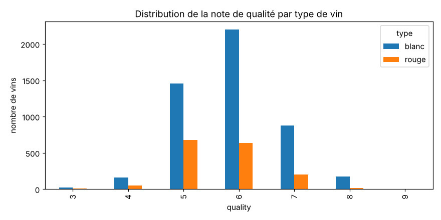

## 2.2 Valeurs manquantes et doublons

- **Valeurs manquantes :** aucune (`isnull().sum()` nul pour toutes les colonnes). Aucune imputation n'est donc nécessaire.
- **Doublons :** le jeu contient **1 177 lignes strictement identiques**. Nous les supprimons. Une même observation pourrait sinon se retrouver à la fois dans l'apprentissage et dans le test, ce qui surestimerait les performances, en particulier celles du k-NN et de l'arbre de décision, qui mémorisent les exemples. Il reste 5 320 vins.

## 2.3 Valeurs aberrantes

Les boxplots (figure 2) et la règle des moustaches ($[Q_1 - 1{,}5\,IQR \,;\, Q_3 + 1{,}5\,IQR]$) signalent au moins une valeur atypique pour **20,6 % des vins**. Nous ne les supprimons pas toutes, pour trois raisons :

1. ce serait perdre un cinquième des données ;
2. plusieurs distributions sont **asymétriques** (sucre résiduel, chlorures, sulfates), ce qui produit mécaniquement de nombreux points hors moustaches ;
3. une partie des écarts vient du **mélange rouge / blanc** : les rouges ont nettement plus de chlorures et d'acidité fixe, et moins de SO2 total.

Nous supprimons uniquement les **valeurs extrêmes**, situées à plus de **5 écarts-types** de la moyenne (|z-score| > 5), soit **62 vins** (1,2 %). Il s'agit de points isolés, comme 65,8 g/L de sucre résiduel ou 289 mg/L de SO2 libre, qui fausseraient la normalisation et les méthodes fondées sur des distances. Il reste **5 258 vins**.

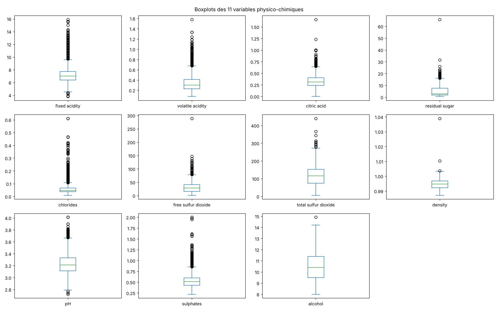

## 2.4 Encodage et transformation en classification binaire

- La variable catégorielle `type` est codée en binaire : `type_rouge` = 1 pour un rouge, 0 pour un blanc (*data conversion*, séance 1).
- La cible est créée selon la consigne : `bon_vin = 1` si `quality ≥ 7`. La note `quality` est ensuite retirée des variables explicatives.

Le modèle dispose ainsi de **12 variables explicatives** (11 mesures + type).

## 2.5 Distribution des classes

Le jeu est **déséquilibré** : **19,1 %** de bons vins contre 80,9 % (figure 3). Les bons vins sont plus fréquents chez les blancs (20,9 %) que chez les rouges (13,7 %).

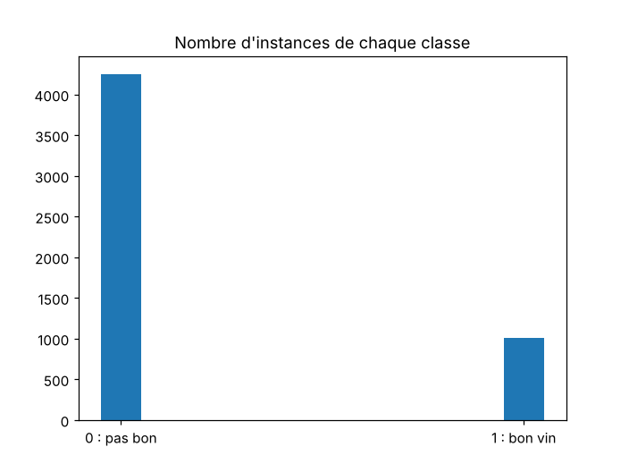

Ce déséquilibre guide toute la suite :

- un modèle qui répondrait toujours « pas bon » atteindrait déjà 81 % d'accuracy : **l'accuracy seule est trompeuse** ;
- nous suivons en priorité le **F1-score** de la classe « bon vin », le **rappel**, la **précision** et l'**AUC** ;
- la séparation apprentissage / test est **stratifiée** (`stratify=Y`) ;
- l'optimisation teste le paramètre `class_weight='balanced'`, qui pondère davantage la classe minoritaire.

## 2.6 Corrélations

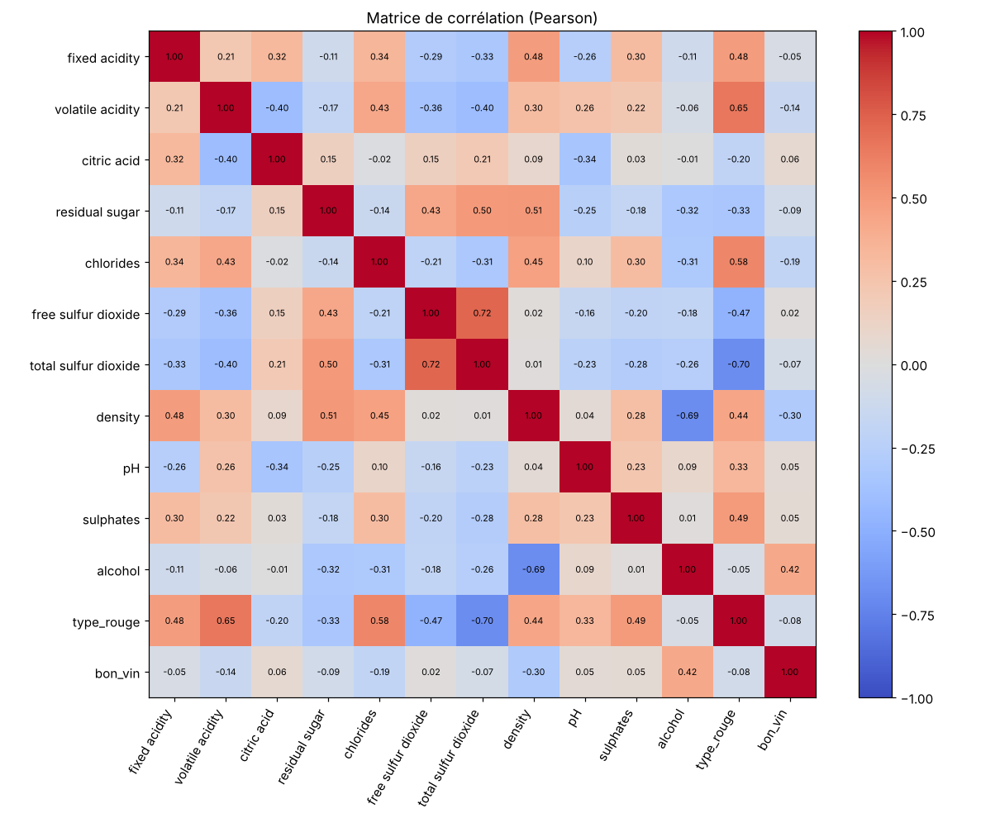

Les variables les plus liées à la qualité (figure 5) sont :

| Variable | Corrélation avec `bon_vin` |
|---|---|
| alcohol | +0,42 |
| density | −0,30 |
| chlorides | −0,19 |
| volatile acidity | −0,14 |
| residual sugar | −0,09 |

Plusieurs variables sont **redondantes** (|r| > 0,6) : densité et alcool (−0,69), SO2 libre et SO2 total (+0,72), type rouge avec SO2 total (−0,70) et avec l'acidité volatile (+0,65). Ces corrélations contredisent l'hypothèse d'**indépendance** de Naive Bayes (séance 3).

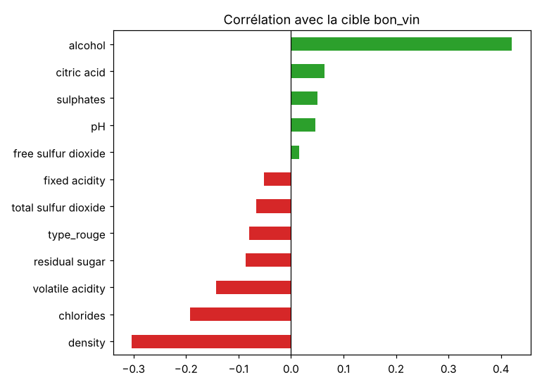

## 2.7 Visualisations

Les histogrammes (figure 6) confirment que plusieurs variables sont asymétriques et ne suivent pas une loi normale : sucre résiduel, chlorures, SO2 libre, sulfates. C'est une seconde hypothèse de Naive Bayes gaussien qui n'est pas respectée. Les boxplots par classe (figure 7) montrent que les bons vins sont **plus alcoolisés**, **moins denses**, et contiennent **moins de chlorures** et **moins d'acidité volatile**.

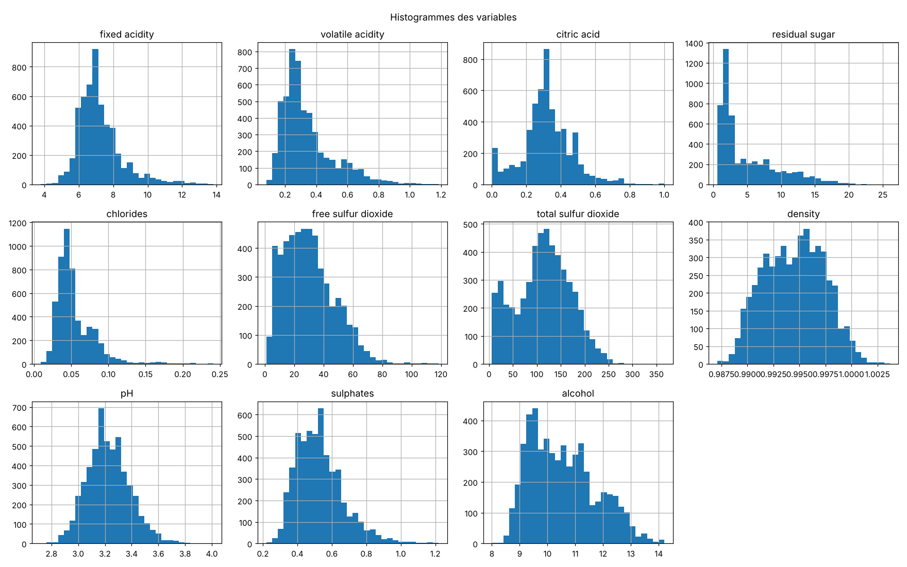

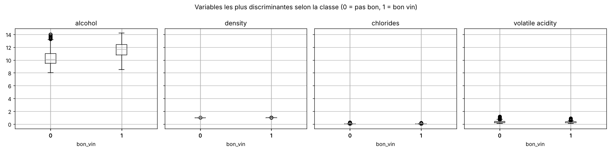

## 2.8 Séparation et normalisation

- `train_test_split(X, Y, test_size=0.25, random_state=1, stratify=Y)` : **3 943 vins** en apprentissage, **1 315** en test, avec 19,1 % de bons vins dans chaque partie.
- `StandardScaler` est ajusté sur l'apprentissage seul, puis appliqué au test, ce qui évite toute fuite d'information du test vers l'apprentissage.

## 2.9 Sélection de variables

Nous appliquons les trois familles de méthodes vues en séance 1, sur la base d'apprentissage uniquement :

- **Filter** : coefficient de Pearson, Chi² (sur données ramenées dans [0, 1] par `MinMaxScaler`), information mutuelle ;
- **Wrapper** : élimination récursive (RFE) avec une régression logistique ;
- **Embedded** : régressions Lasso (pénalité L1) et Ridge (pénalité L2).

Chaque méthode retient ses 6 meilleures variables (les coefficients non nuls pour le Lasso), puis nous comptons les votes (figure 8).

| Variable | Votes (sur 6) | Variable | Votes (sur 6) |
|---|---|---|---|
| alcohol | 6 | citric acid | 2 |
| residual sugar | 5 | fixed acidity | 2 |
| density | 5 | sulphates | 2 |
| volatile acidity | 4 | type_rouge | 2 |
| chlorides | 4 | total sulfur dioxide | 1 |
| pH | 3 | free sulfur dioxide | 1 |

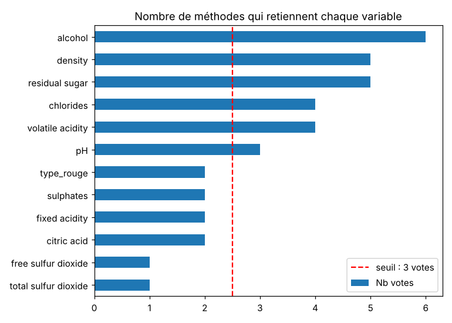

Les 6 variables qui obtiennent au moins 3 votes sont : alcool, sucre résiduel, densité, acidité volatile, chlorures et pH. Nous avons comparé les modèles entraînés sur ces 6 variables et sur les 12 (tableau 1).

| Modèle | F1 (12 var.) | F1 (6 var.) | AUC (12 var.) | AUC (6 var.) |
|---|---|---|---|---|
| k-NN (k=5) | 0,492 | 0,437 | 0,786 | 0,772 |
| Naive Bayes | 0,465 | **0,475** | 0,764 | 0,765 |
| Arbre de décision | 0,442 | 0,395 | 0,655 | 0,626 |
| Régression logistique | 0,428 | 0,396 | 0,823 | 0,816 |
| SVM RBF | 0,396 | 0,324 | 0,818 | 0,749 |

: Tableau 1 – Effet de la sélection de variables (test, données normalisées)

La sélection **dégrade** la plupart des modèles. Seul Naive Bayes progresse légèrement, parce qu'en retirant des variables corrélées on se rapproche de son hypothèse d'indépendance. Les variables écartées apportent donc encore une information utile, notamment aux modèles non linéaires. Avec seulement 12 variables, il n'y a pas de risque d'explosion dimensionnelle. **Nous conservons donc les 12 variables** ; la sélection sert surtout à l'interprétation, en désignant les variables clés de la qualité.

# 3. Modélisation

## 3.1 Choix et justification des modèles

| Modèle | Type | Propriétés théoriques | Adaptation à nos données |
|---|---|---|---|
| Régression logistique | Linéaire | Sigmoïde appliquée à $wx+b$ (séance 2), sortie probabiliste, faible variance | Sensible à l'échelle et aux variables corrélées ; peut manquer les relations non linéaires |
| k-NN | Non linéaire | Vote des k plus proches voisins, frontière très flexible | Fondé sur une distance : normalisation indispensable ; sensible au bruit et au déséquilibre |
| Arbre de décision | Non linéaire | Partitions successives, critère d'entropie et gain d'information (ID3 / C4.5, séance 2) ; seuils pour les attributs continus | Insensible à l'échelle, interprétable ; forte variance sans limite de profondeur |
| Naive Bayes gaussien | Non linéaire | Règle de Bayes, variables indépendantes et gaussiennes dans chaque classe (séance 3) | Hypothèses non respectées (variables corrélées et asymétriques) → biais attendu |
| SVM linéaire | Linéaire | Hyperplan de marge maximale | Sensible à l'échelle |
| SVM noyau RBF | Non linéaire | Marge maximale dans un espace transformé par un noyau gaussien | Capture les non-linéarités ; `C` et `gamma` règlent le compromis biais / variance |

Ce choix permet de comparer des modèles **linéaires** et **non linéaires**, afin de savoir si la frontière entre bons et moins bons vins est simple ou non.

## 3.2 Protocole d'évaluation

Comme demandé dans le TP1, une fonction `evaluer_modele` entraîne chaque modèle puis calcule, sur le test : accuracy, précision, rappel, F1-score, AUC, la moyenne accuracy + rappel du TP1, ainsi que l'accuracy et le F1 sur l'apprentissage (pour l'analyse biais / variance). Elle affiche aussi la matrice de confusion et le rapport de classification. L'arbre de décision reprend la configuration du TP1 (`criterion='entropy'`, `random_state=0`).

## 3.3 Effet de la normalisation

Chaque modèle est entraîné sur les données brutes, puis sur les données normalisées (parties 3 et 4 du TP1).

| Modèle | F1 brut | F1 normalisé | AUC brut | AUC normalisé |
|---|---|---|---|---|
| SVM RBF | 0,000 | 0,396 | 0,788 | 0,818 |
| k-NN (k=5) | 0,279 | 0,492 | 0,689 | 0,786 |
| Régression logistique | 0,403 | 0,428 | 0,819 | 0,823 |
| Arbre de décision | 0,439 | 0,442 | 0,653 | 0,655 |
| Naive Bayes | 0,474 | 0,465 | 0,767 | 0,764 |
| SVM linéaire | 0,321* | 0,000 | 0,589 | 0,798 |

: Tableau 2 – Effet de la normalisation (* le SVM linéaire n'a pas convergé sur les données brutes)

- **k-NN** et **SVM RBF** progressent fortement. Leurs distances sont dominées, sans normalisation, par les variables de grande échelle (SO2) ; le SVM RBF prédisait même « pas bon » pour tous les vins.
- **L'arbre de décision** est pratiquement inchangé : ses tests « variable > seuil » ne dépendent pas de l'échelle.
- **Naive Bayes** est quasiment inchangé. Le léger écart vient de `var_smoothing`, qui ajoute à chaque variance une fraction de la plus grande variance du jeu.
- **SVM linéaire** : une fois normalisé, il converge mais prédit « pas bon » pour **tous** les vins (F1 = 0). Avec 81 % de classe 0 et des classes qui se chevauchent, la fonction de coût ne justifie aucune prédiction positive. Son AUC de 0,80 montre pourtant que son score ordonne correctement les vins : c'est le **seuil de décision** qui est inadapté au déséquilibre.

Nous travaillons désormais sur les **données normalisées et les 12 variables**.

# 4. Évaluation des modèles

## 4.1 Comparaison des performances

| Modèle | Accuracy | Précision | Rappel | F1 | AUC | Moy. acc+rappel (TP1) |
|---|---|---|---|---|---|---|
| k-NN (k=5) | 0,826 | 0,555 | 0,442 | **0,492** | 0,786 | 0,634 |
| Naive Bayes | 0,734 | 0,377 | **0,606** | 0,465 | 0,764 | **0,670** |
| Arbre de décision | 0,787 | 0,442 | 0,442 | 0,442 | 0,655 | 0,615 |
| Régression logistique | 0,823 | 0,558 | 0,347 | 0,428 | **0,823** | 0,585 |
| SVM RBF | **0,830** | **0,619** | 0,291 | 0,396 | 0,818 | 0,561 |
| SVM linéaire | 0,809 | 0,000 | 0,000 | 0,000 | 0,798 | 0,405 |

: Tableau 3 – Modèles de base sur le test (données normalisées)

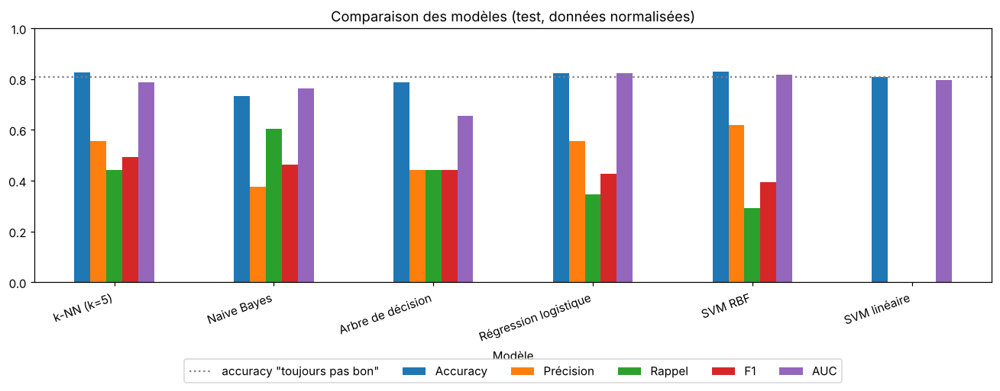

Aucun modèle ne se détache. Les accuracies (0,73 à 0,83) sont à peine supérieures à celle du classifieur trivial (0,81), alors que les rappels sont faibles. Les modèles les plus « prudents » (SVM RBF, régression logistique) ont la meilleure précision et la meilleure AUC, mais ne détectent qu'un bon vin sur trois. Naive Bayes, à l'inverse, détecte 61 % des bons vins au prix de nombreux faux positifs.

## 4.2 Matrices de confusion

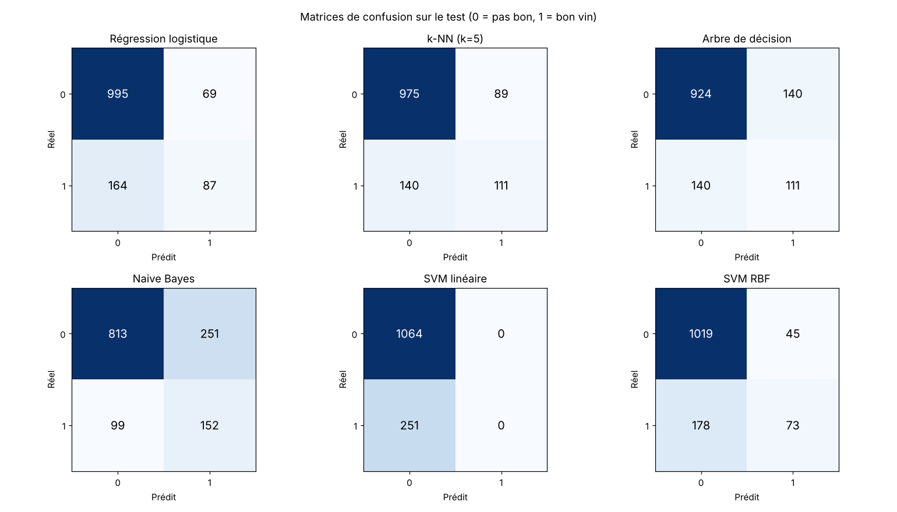

Sur les 251 bons vins du test, le SVM RBF n'en reconnaît que 73 et la régression logistique 87, contre 152 pour Naive Bayes. Le SVM linéaire n'en reconnaît aucun.

## 4.3 Courbes ROC et AUC

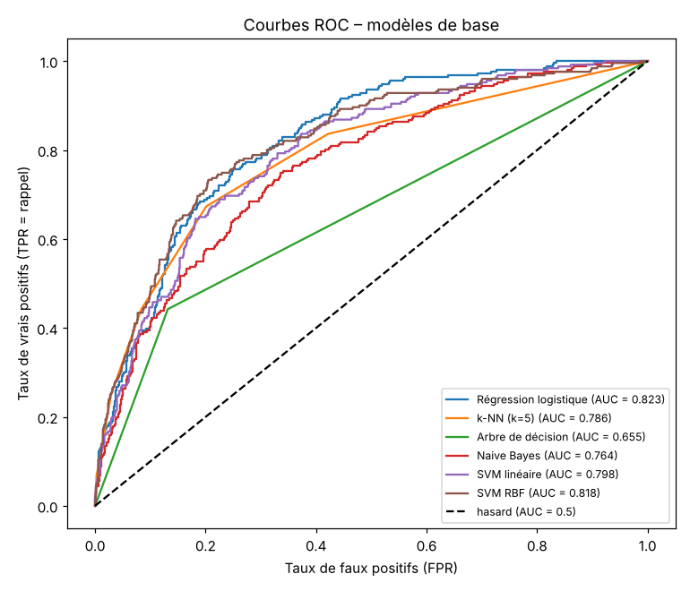

Les courbes ROC (séance 2) évaluent les modèles pour tous les seuils de décision. La régression logistique (AUC 0,823), le SVM RBF (0,818) et le SVM linéaire (0,798) séparent bien les classes. Leurs faibles rappels viennent donc du **seuil de 0,5**, mal adapté à une classe minoritaire, et non d'un manque d'information. L'arbre de décision non contraint a l'AUC la plus faible (0,655) : ses feuilles, presque toutes pures, ne produisent quasiment que des probabilités 0 ou 1, ce qui ne permet pas d'ordonner finement les vins.

## 4.4 Compromis biais / variance

| Modèle | F1 train | F1 test | Écart | F1 CV (moy.) | F1 CV (écart-type) |
|---|---|---|---|---|---|
| Régression logistique | 0,414 | 0,428 | −0,013 | 0,411 | 0,036 |
| k-NN (k=5) | 0,638 | 0,492 | 0,145 | 0,448 | 0,025 |
| Arbre de décision | **1,000** | 0,442 | **0,558** | 0,437 | 0,032 |
| Naive Bayes | 0,507 | 0,465 | 0,042 | 0,504 | 0,025 |
| SVM linéaire | 0,000 | 0,000 | 0,000 | 0,000 | 0,000 |
| SVM RBF | 0,463 | 0,396 | 0,067 | 0,404 | 0,009 |

: Tableau 4 – Erreur d'apprentissage, de test et validation croisée à 5 plis

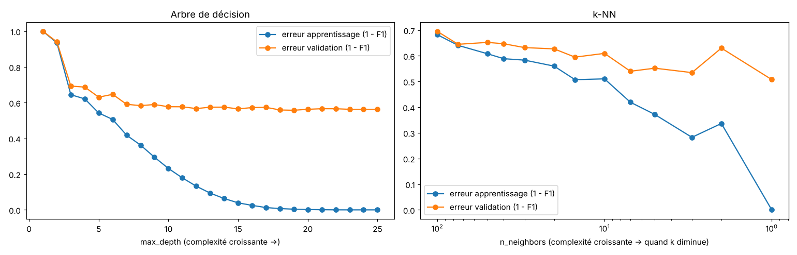

D'après le tableau sous-apprentissage / sur-apprentissage de la séance 1 :

- **Arbre de décision : sur-apprentissage** (faible biais, forte variance). Le F1 vaut 1,000 en apprentissage contre 0,442 en test. Sur la figure 12, l'erreur d'apprentissage tombe à 0 quand la profondeur augmente, alors que l'erreur de validation stagne autour de 0,56 au-delà d'une dizaine de niveaux.
- **k-NN : variance notable** (écart de 0,145). Réduire k augmente la complexité, mais l'erreur de validation continue de baisser jusqu'à k = 1 : avec un grand k, le vote est dominé par la classe majoritaire.
- **Régression logistique, Naive Bayes, SVM RBF : biais**. Les écarts sont faibles mais les F1 modestes, à cause du seuil défavorable à la classe minoritaire.
- **SVM linéaire : sous-apprentissage complet**.
- Les écarts-types en validation croisée sont faibles (≤ 0,036) : les résultats sont stables.

L'optimisation doit donc **réduire la variance** de l'arbre et du k-NN, et **corriger le biais de seuil** des autres modèles.

# 5. Optimisation des hyperparamètres

## 5.1 Protocole

- **Grid Search** (`GridSearchCV`) pour la régression logistique, le SVM RBF et Naive Bayes, dont les grilles sont petites.
- **Random Search** (`RandomizedSearchCV`, 60 tirages) pour l'arbre de décision et le k-NN, dont les espaces de recherche sont plus grands.
- Validation croisée **stratifiée à 5 plis** (k-fold) sur l'apprentissage uniquement, avec le **F1-score** comme critère. Le test n'est utilisé qu'une seule fois, à la fin (séance 1).
- `class_weight` ∈ {`None`, `'balanced'`} fait partie de l'espace de recherche des modèles qui l'acceptent.
- Le SVM linéaire n'est pas réoptimisé : la famille linéaire est couverte par la régression logistique et le SVM par sa version à noyau RBF.

## 5.2 Résultats

| Modèle | Méthode | Meilleurs hyperparamètres | F1 CV |
|--------|---------|-----------------------------|----|
| SVM RBF | Grid (32 comb.) | C = 100, gamma = 0,01, class_weight = balanced | **0,560** |
| Régression logistique | Grid (12 comb.) | C = 0,01, class_weight = balanced | 0,549 |
| Arbre de décision | Random (60 tirages) | entropy, max_depth = 5, min_samples_leaf = 24, class_weight = balanced | 0,510 |
| Naive Bayes | Grid (12 comb.) | var_smoothing = 0,01 | 0,506 |
| k-NN | Random (60 tirages) | k = 1, distance de Manhattan (p = 1), pondération par la distance | 0,497 |

: Tableau 5 – Meilleurs hyperparamètres (validation croisée à 5 plis)

**Tous les modèles qui l'acceptent retiennent `class_weight='balanced'`**, ce qui confirme que le déséquilibre des classes était la principale limite. L'arbre retenu est **peu profond (5 niveaux)** avec au moins 24 vins par feuille : la recherche a réduit sa variance.

## 5.3 Grid Search ou Random Search ?

Sur le SVM RBF, nous avons comparé la grille (32 combinaisons) à un Random Search de 16 tirages sur des intervalles continus de `C` et `gamma` :

| | Grid Search | Random Search |
|---|---|---|
| Combinaisons testées | 32 | 16 |
| Meilleur F1 (CV) | 0,560 | 0,545 |
| Temps de calcul | environ 28 s | environ 17 s |
| Meilleurs paramètres | C = 100, gamma = 0,01 | C = 0,22, gamma = 0,030 |

: Tableau 6 – Comparaison Grid Search / Random Search sur le SVM RBF

Le Random Search obtient un résultat proche en deux fois moins de combinaisons. Ici, la grille reste meilleure parce que l'espace est petit et bien choisi. Le Random Search devient avantageux quand le nombre d'hyperparamètres augmente, d'où son usage pour l'arbre (4 paramètres) et le k-NN.

## 5.4 Modèles optimisés sur le test

| Modèle optimisé | Accuracy | Précision | Rappel | F1 | AUC | Moy. TP1 | F1 train |
|---|---|---|---|---|---|---|---|
| **SVM RBF** | 0,721 | 0,389 | 0,813 | **0,526** | **0,841** | **0,767** | 0,583 |
| Régression logistique | 0,717 | 0,384 | 0,797 | 0,518 | 0,823 | 0,757 | 0,546 |
| Arbre de décision | 0,695 | 0,366 | **0,817** | 0,506 | 0,808 | 0,756 | 0,533 |
| k-NN | **0,802** | **0,482** | 0,494 | 0,488 | 0,685 | 0,648 | 1,000 |
| Naive Bayes | 0,734 | 0,377 | 0,606 | 0,465 | 0,765 | 0,670 | 0,505 |

: Tableau 7 – Modèles optimisés sur le test

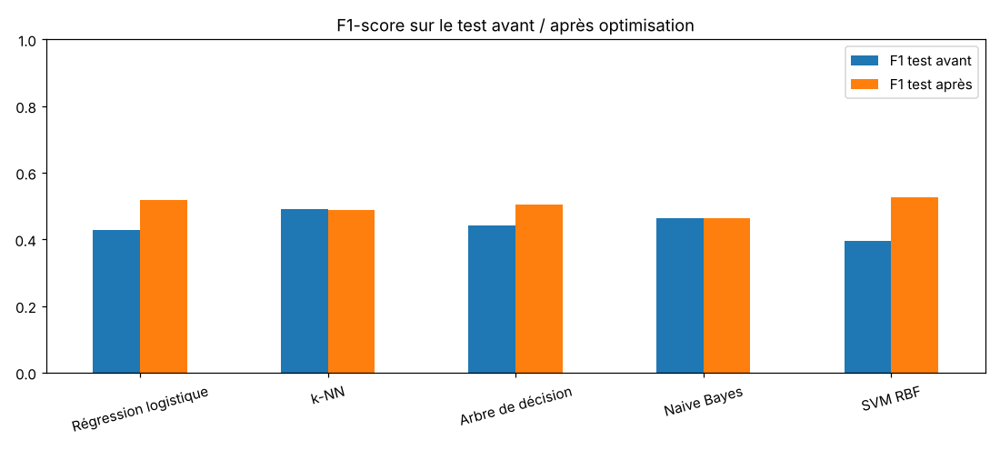

- Le F1 progresse nettement pour le **SVM RBF** (0,396 → 0,526), la **régression logistique** (0,428 → 0,518) et l'**arbre** (0,442 → 0,506). Le rappel passe d'environ 0,3–0,4 à environ 0,8.
- L'AUC de l'arbre bondit de 0,655 à 0,808 : en limitant la profondeur, ses feuilles produisent des probabilités nuancées.
- Le **k-NN** ne progresse pas : la recherche choisit k = 1, un modèle qui sur-apprend (F1 train = 1,0) et dont l'AUC chute (0,685), car il ne produit que des scores 0 ou 1.
- **Naive Bayes** n'est pas amélioré : ses limites viennent de ses hypothèses, pas de ses hyperparamètres.

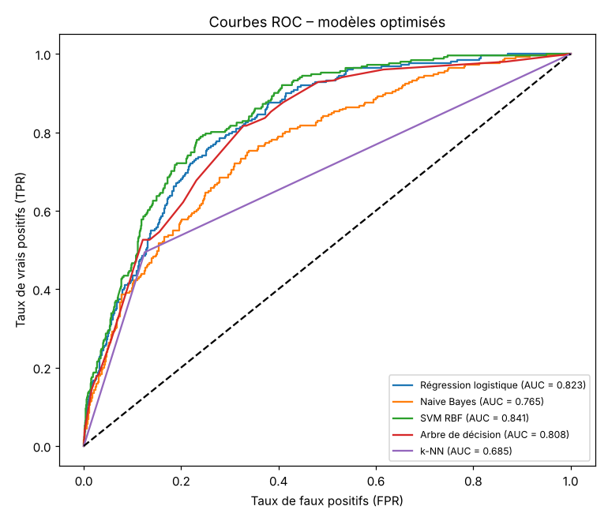

## 5.5 Modèle final

Le modèle final est choisi sur le **F1 en validation croisée**, et non sur le test, pour ne pas biaiser l'évaluation : il s'agit du **SVM à noyau RBF** (`C=100`, `gamma=0.01`, `class_weight='balanced'`), associé au `StandardScaler` dans un `Pipeline`.

| | Prédit « pas bon » | Prédit « bon » |
|---|---|---|
| **Réel « pas bon »** (1 064) | 744 | 320 |
| **Réel « bon »** (251) | 47 | **204** |

: Tableau 8 – Matrice de confusion du modèle final sur le test

C'est aussi le modèle qui présente le **meilleur compromis biais / variance** :

- il obtient les meilleurs F1 (0,526), AUC (0,841) et moyenne accuracy + rappel du TP1 (0,767) sur le test ;
- l'écart entre apprentissage et test est faible (F1 0,583 contre 0,526), alors que le k-NN optimisé sur-apprend ;
- il détecte **81 % des bons vins** (204 sur 251), au prix d'une précision de 0,39 : 320 vins sont signalés « bons » à tort.

Ce compromis précision / rappel dépend du seuil de décision. Avec `class_weight='balanced'`, le modèle classe un vin « bon » dès que sa probabilité estimée dépasse environ **19 %**, et non 50 %. Selon l'usage, on peut déplacer ce seuil le long de la courbe ROC. Pour constituer une sélection « premium » sans erreur, on relèverait le seuil afin de privilégier la précision.

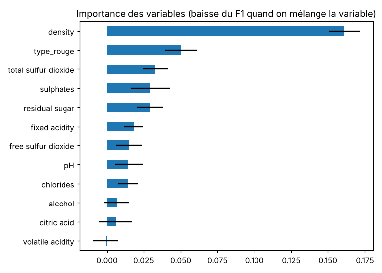

**Interprétation.** L'importance par permutation (figure 15) mesure la baisse du F1 quand on mélange une variable. La **densité** arrive largement en tête, suivie du type de vin et du SO2 total. L'**alcool**, pourtant la variable la plus corrélée à la qualité, paraît peu important. Cela s'explique par sa forte corrélation avec la densité (r = −0,69) : quand on mélange l'alcool, le modèle retrouve l'essentiel de l'information dans la densité. L'importance par permutation mesure ce qu'une variable apporte **en plus des autres**, et non son lien direct avec la cible.

# 6. Conclusion

| Étape | Résultat principal |
|---|---|
| Prétraitement | 6 497 → 5 258 vins (1 177 doublons, 62 valeurs extrêmes) ; aucune valeur manquante ; 19,1 % de bons vins |
| Analyse | Alcool, densité, chlorures et acidité volatile sont les variables les plus liées à la qualité ; plusieurs variables sont redondantes |
| Normalisation | Indispensable pour k-NN et SVM, sans effet notable sur l'arbre et Naive Bayes |
| Sélection de variables | Noyau de 6 variables identifié, mais les 12 variables donnent de meilleurs résultats |
| Modèles de base | F1 de 0,40 à 0,49 : arbre en sur-apprentissage, modèles linéaires biaisés vers la classe majoritaire |
| Optimisation | `class_weight='balanced'` décisif ; meilleur modèle : **SVM RBF**, F1 = 0,526 et AUC = 0,841 sur le test |

Le déséquilibre des classes est le point central de ce projet. Les modèles non pondérés obtiennent une accuracy flatteuse mais détectent mal les bons vins. La pondération des classes, choisie par validation croisée, fait passer le rappel d'environ 0,3 à 0,8. Le SVM à noyau RBF optimisé offre le meilleur équilibre entre performance et stabilité.

**Limites.** La qualité est une **note sensorielle** attribuée par des dégustateurs : les 11 mesures physico-chimiques n'en expliquent qu'une partie, ce qui plafonne les performances (F1 autour de 0,5).

**Perspectives.**

- Tester des méthodes d'ensemble (forêts aléatoires, boosting).
- Entraîner des modèles séparés pour les rouges et les blancs.
- Choisir le seuil de décision par validation croisée selon l'usage visé.
- Évaluer des techniques de rééquilibrage des classes (sur-échantillonnage de la classe minoritaire).

# 7. Bonus réalisés

| Bonus | Réalisation |
|---|---|
| Dépôt Git | Dépôt initialisé avec README, prêt à être poussé sur GitHub ou GitLab |
| Tests unitaires | 12 tests `pytest` (`tests/test_vin_qualite.py`) : chargement, nettoyage, encodage, cible, séparation stratifiée, métriques, cohérence du seuil, prédiction |
| Conteneurisation | `Dockerfile` : installe les dépendances, réentraîne le modèle, lance les tests, puis démarre l'application |
| Application web | `app.py` (Streamlit) : prédiction pour un vin du jeu de test ou pour des mesures saisies, avec la probabilité estimée et le seuil de décision |

Le module `src/vin_qualite.py` regroupe les fonctions du notebook (chargement, nettoyage, encodage, séparation, évaluation, modèle final) ; il reproduit exactement les résultats du tableau 8.

# Références

- Cours Machine Learning I, séances 1 à 3, TP1 (arbre de décision), TP3 (Naive Bayes), TD1 et TD2 – EFREI 2026/2027.
- P. Cortez, A. Cerdeira, F. Almeida, T. Matos, J. Reis. *Modeling wine preferences by data mining from physicochemical properties*. Decision Support Systems, 47(4), 547–553, 2009.
- Documentation scikit-learn : https://scikit-learn.org
